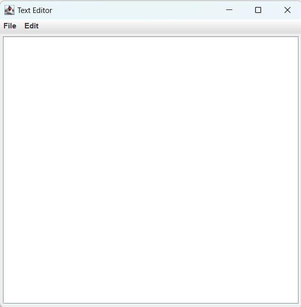
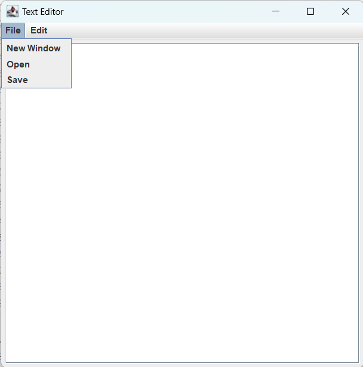
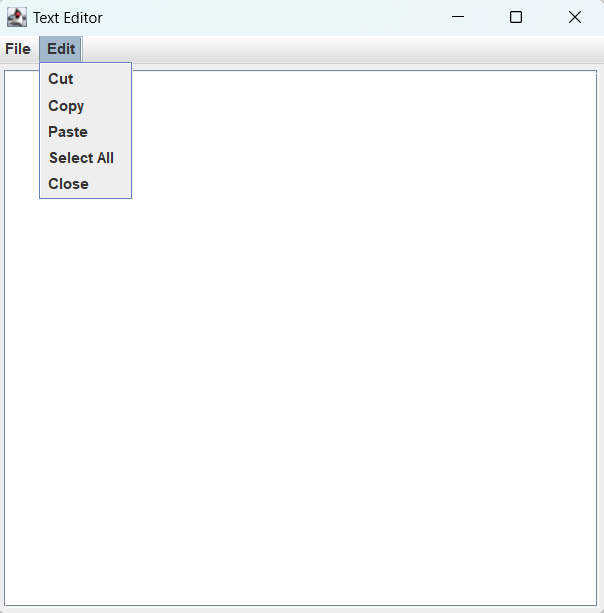

# Text-Editor

## ➡️ Introduction:
Text Editor is a lightweight and user-friendly text editor designed to provide a streamlined writing experience for users.

## ➡️ Technologies Used:
1. Java.
2. Java Swing.
3. AWT.

## ➡️ Project Description:
The TextEditor project is a basic text editor application developed in Java using the Swing library. It provides users with a graphical user interface for creating, editing, and saving text files. The main features and components of this text editor include:

👉 Menu Bar: The application includes a menu bar at the top of the window with two main menus: "File" and "Edit".

👉 "File" features:

Open File: Users can open existing text files from their local filesystem using the "Open File" menu option.

New Window: Users can open a new instance of the text editor in a separate window by selecting the "New Window" menu option.

👉 "Edit" features:

Cut, Copy, and Paste: The application provides standard text editing functionality, allowing users to cut, copy, and paste text within the text area.

Select All: Users can select all text within the text area using the "Select All" menu option.

Close: When the user closes the application window, it exits gracefully using System.exit(0).

## ➡️ SCREENSHOTS

